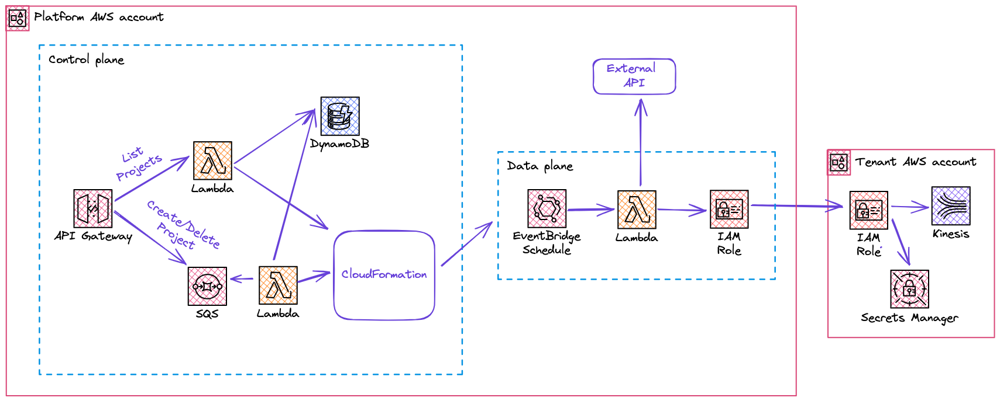

# Project Overview

The following architecture overview contains the three core components of the platform architecture.

### Control plane

This API can be used by platform customers for managing projects.

### Data plane

The data plane is deployed for every tenant's project. A schedule triggers a Lambda Function at the specified rate. The data plane assumes a cross-account role, in order to retrieve the tenant's External API Secret, as well as permission to write into the tenant's Ingestion Service.

### Tenant Environment

Tenants are required to provision a CloudFormation Stack, that contains essential resources, like the IAM Role, a Secrets Manager Secret and the target ingestion Service.

## Project Onboarding

The following steps are required, to onboard a project.

1. Tenant provisions the tenant-stack with CloudFormation. 
2. Tenant calls the create project endpoint of the control plane and specifies the required outputs.
3. Tenant waits for successful provisioning of the project and updates its tenant-stack with the IAM Role ARN of its project. The ARN can be retrieved by calling the get projects endpoint.

## Terminology

- **Control plane**: Component responsible for managing the projects of a customer.
- **Data plane**: Component responsible for actual execution of the platform's purpose.
- **API Poller**: Part of the data plane responsible for calling the external API.
- **Tenant**: A customer of the platform
- **Tenant Stack**: Core customer resources, that reside in the customer's account.
- **Project**: One instance of a Resource hosted by the external API that is getting polled by a specified rate and ingested into a target service in the tenant's account
- **Target Ingestion Service**: Data Service where the API Response should be ingested to. Currently, Kinesis Data Streams are supported.
- **Platform Account**: Central account where the data and control plane is hosted. Tenants dont have access to this environment.
- **Tenant API Key**: The API Key of the tenant, which is required to call the external API.

## Roadmap

- API Documentation
- Tenant isolation trough authentication
- Add update project endpoint
- Platform Monitoring Dashboard
- Tenant SNS Onboarding Topic. Send message in case customer forgets to update Stack during oboarding.
- Platform Service Quota Monitoring/Management
